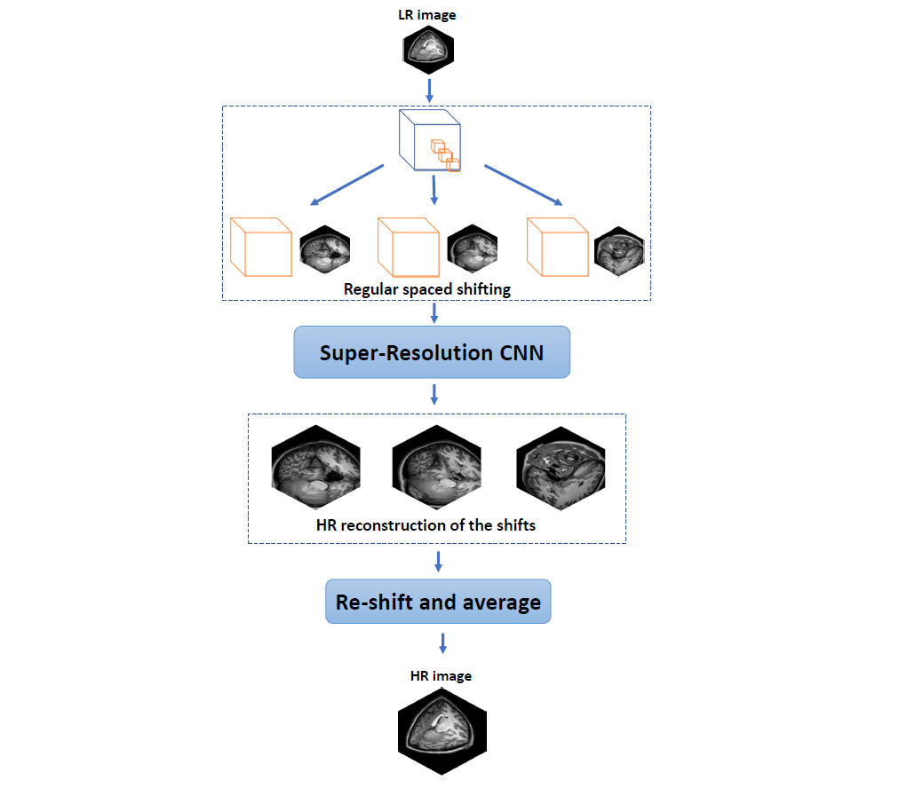

## Deep learning-based super-resolution of 3D magnetic resonance images by regularly spaced shifting

This repository contains the source code of the paper [Deep learning-based super-resolution of 3D magnetic resonance images by regularly spaced shifting](https://doi.org/10.1016/j.neucom.2019.05.107).

This code executes the **SRCNN3D+RegSS** method for a set of input images. The contents of this code are provided without any warranty. They are intended for evaluational purposes only.

  

### Pre-requisites

- The **SRCNN3D** method must be installed in the system. Please, follow instalation instructions from [here](https://github.com/rousseau/deepBrain/tree/master/SRCNN3D).
- Matlab (tested on v2018b or earlier). Deep learning toolbox is required to execute VDSR competing method.
---

### Set up

1. Open Demo_SRCNN3D_RegSS.sh.
2. Set the appropiate paths.
3. Set the desired ZoomFactor value.
4. The folder 'Images' should sotre those images that are going to be reconstructed.
There are two options mutually compatibles:
- Use HR images as the input. In this case, the HR will be downsampled using ZoomFactor  and the resulting LR image will be processed. Finally, quality measures are displayed.
- Use LR as input. Quality won't be displayed as there is not a HR reference image.
---

### Run the Demo
Run Demo_SRCNN3D_RegSS.sh in a bash shell. If a Conda environment is used, please activate it 
before launch the script.
---

### Citation

Please, cite this work as:

Karl Thurnhofer-Hemsi, Ezequiel López-Rubio, Enrique Domínguez, Rafael Marcos Luque-Baena, Núria Roé-Vellvé,
Deep learning-based super-resolution of 3D magnetic resonance images by regularly spaced shifting,
Neurocomputing, Volume 398, 314-327, 2020. ISSN 0925-2312
https://doi.org/10.1016/j.neucom.2019.05.107.
(https://www.sciencedirect.com/science/article/pii/S0925231219314808)